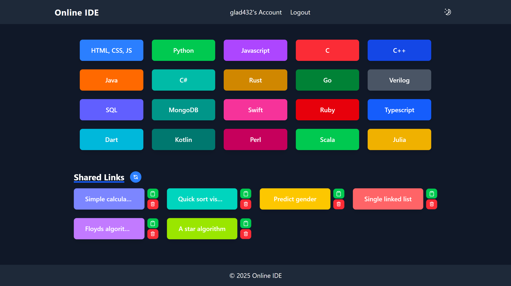
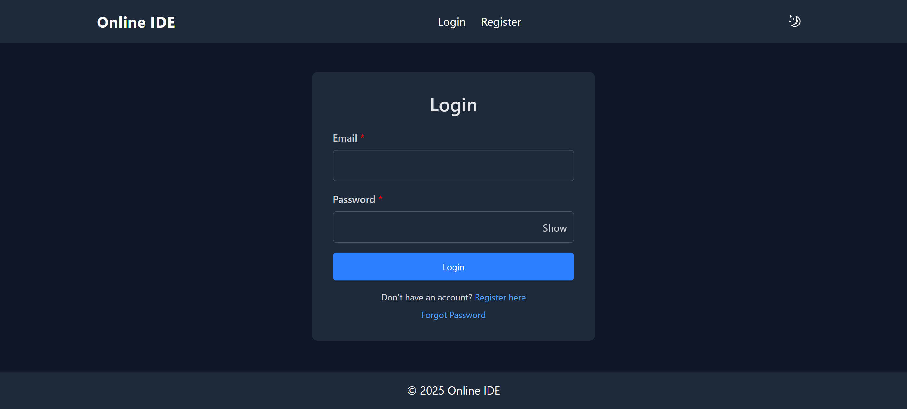
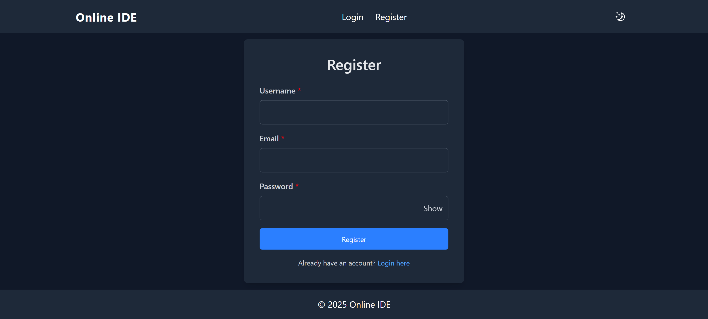
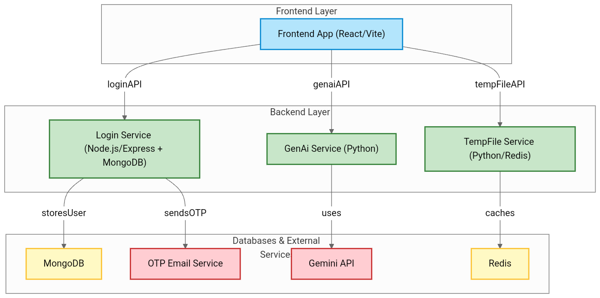
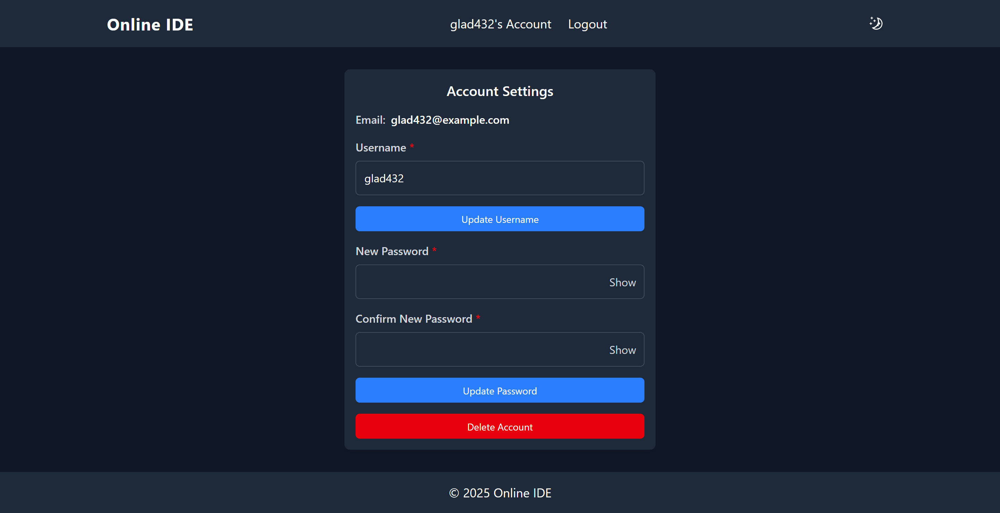

# 💻 Online IDE

A modern **AI-powered Online Integrated Development Environment (IDE)** that enables users to write, edit, generate, refactor, and share code through a secure web interface. The platform supports multiple programming languages, secure user authentication, AI-assisted coding using **Google Gemini AI**, and temporary code sharing, providing a seamless browser-based development experience. :contentReference[oaicite:0]{index=0}

---

# 🚀 Features

## 🔐 Authentication

- User Registration
- Secure Login
- JWT Authentication
- Password Encryption
- OTP Email Verification
- Protected Routes

---

## 💻 Code Editor

- Monaco Editor (VS Code Editor)
- Syntax Highlighting
- Multi-language Support
- Code Formatting
- Responsive Editor Interface

---

## 🤖 AI Features

- AI Code Generation
- AI Code Refactoring
- Code Optimization
- Code Explanation
- Smart Code Assistance

---

## 📤 Code Sharing

- Temporary Shareable Links
- Secure Code Sharing
- Unique Share URLs
- Redis-based Temporary Storage

---

## ⚡ Developer Experience

- Fast Vite Frontend
- Responsive UI
- REST API Architecture
- Modular Microservice Design

---

# 🌍 Supported Languages

- HTML
- CSS
- JavaScript
- TypeScript
- Python
- Java
- C
- C++
- C#
- Go
- Rust
- Kotlin
- Swift
- SQL
- MongoDB
- Dart
- Scala
- Julia
- Perl
- Verilog

---

# 💻 Technology Stack

## Frontend

- React
- Vite
- Tailwind CSS
- Sass
- Monaco Editor
- React Router
- SweetAlert2
- Lodash

---

## Backend

- Node.js
- Express.js
- JWT Authentication
- bcrypt
- Nodemailer
- MongoDB
- Mongoose

---

## AI Service

- Python
- Flask
- Google Gemini API
- Flask-CORS

---

## Temporary Share Service

- Python
- Redis
- UUID
- PyJWT

---

# 🗄 Database

- MongoDB
- Redis

---

# 📂 Project Structure

```text
Online-Ide
│
├── Frontend/
│
├── Backend/
│   ├── Login/
│   ├── GenAI/
│   └── TempFile/
│
├── Images/
│
├── README.md
└── .env
```

---

# ✨ Key Features

- Secure Authentication
- AI Code Generation
- AI Code Refactoring
- Multi-Language Support
- Monaco Code Editor
- Code Sharing
- REST APIs
- Responsive Design
- Redis Integration
- MongoDB Database
- JWT Authorization
- Email OTP Verification

---

# ⚙️ Installation

## Clone Repository

```bash
git clone https://github.com/SahilPowale/Online-Ide.git
```

## Install Frontend

```bash
cd Frontend
npm install
npm run dev
```

---

## Install Login Backend

```bash
cd Backend/Login
npm install
node server.js
```

---

## Install AI Service

```bash
cd Backend/GenAI
pip install -r requirements.txt
python app.py
```

---

## Install Temporary Share Service

```bash
cd Backend/TempFile
pip install -r requirements.txt
python app.py
```

---

## Configure Environment Variables

Create a `.env` file and configure:

- MongoDB URI
- JWT Secret
- Gemini API Key
- Redis Credentials
- Email Credentials
- Backend URLs

---

# 📸 Screenshots

**Home Page**


**Login**


**Registration**


**Architecture Diagram**


**Account Dashboard**


---

# 📈 Future Enhancements

- Real-Time Collaborative Coding
- Integrated Terminal
- File Explorer
- Project Management
- GitHub Integration
- Docker Support
- AI Chat Assistant
- Voice Commands
- Dark/Light Theme
- Live Collaboration
- Plugin System
- Cloud Project Storage

---

# 🎯 Learning Outcomes

This project helped strengthen practical knowledge of:

- React Development
- Node.js & Express.js
- Python Flask
- REST API Development
- JWT Authentication
- MongoDB
- Redis
- Google Gemini AI Integration
- Microservice Architecture
- Environment Configuration
- Git & GitHub
- Full-Stack Web Development

---

# 👨‍💻 Author

**Sahil Powale**

- GitHub: https://github.com/SahilPowale
- LinkedIn: https://www.linkedin.com/in/sahil-p-38a1b2249/

---

# 📄 License

This project is licensed under the **MIT License**.
